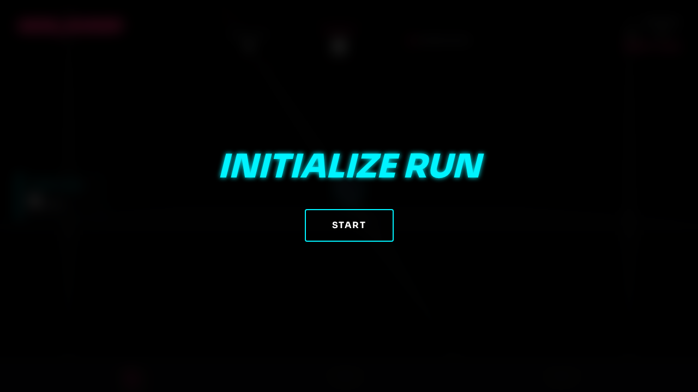
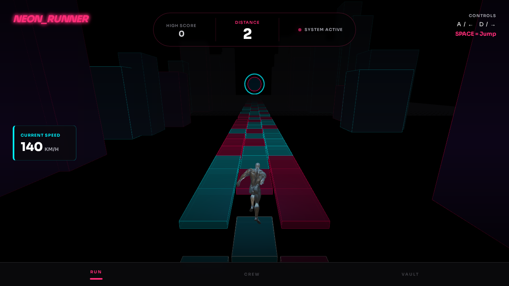
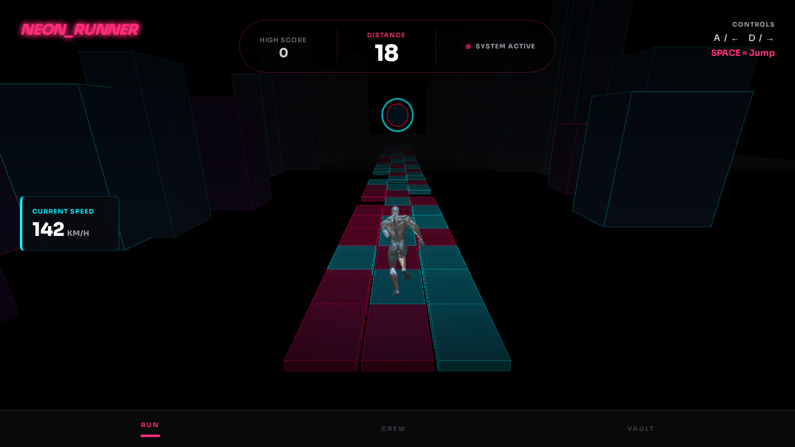
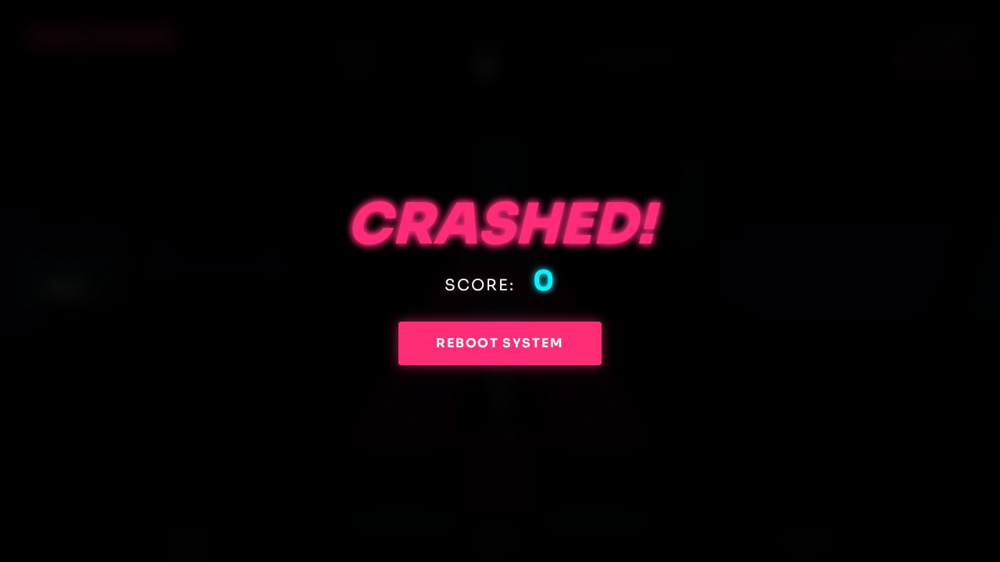

# Neon Runner 🏃‍♂️💨

An endless 3D runner game built with HTML, Tailwind CSS, and Three.js! Dodge the gaps, jump over obstacles, and see how far you can run in this neon-infused cyber world! 🌆✨

The game features modular JavaScript architecture, optimized 3D models using Meshopt Decoder, and a modern build pipeline via Vite.

## 🎮 How to Play

- **Start Game:** Click Start
- **Move Left/Right:** `A` / `D` or `Left Arrow` / `Right Arrow`
- **Jump:** `Space`
- **Pause/Resume:** `Escape` or `P`

Dodge the gaps in the platforms and don't fall off! The game speeds up the further you get. 🚀

## 📸 Screenshots

Here's a glimpse of the action:

| Start Screen | Gameplay | Jumping |
| --- | --- | --- |
|  |  |  |
| **Pause Screen** | **Game Over** | |
|  |  | |

## 🚀 Live Demo

Play the latest stable version of the game here (deployed via the `gh-pages` branch):
[https://jaycewright.github.io/NEON_RUNNER/](https://jaycewright.github.io/NEON_RUNNER/)

### Experimental r170 Version
We also have an updated version running on a newer build of Three.js (r170). Check it out here:
[https://jaycewright.github.io/NEON_RUNNER/r170/](https://jaycewright.github.io/NEON_RUNNER/r170/)

## 🚀 How to Run Locally

The game has been updated to use modern web development tools like [Vite](https://vitejs.dev/) for an improved development experience and a modular codebase.

### Prerequisites
- [Node.js](https://nodejs.org/) installed on your machine.

### Setup

1.  Clone the repository and open your terminal in the project directory.
2.  Install dependencies:
    ```bash
    npm install
    ```
3.  Start the development server:
    ```bash
    npm run dev &
    ```
4.  Open your browser and navigate to the local URL provided by Vite (usually `http://localhost:5173`).

### Building for Production

To build the project for production, run:
```bash
npm run build
```
This will generate optimized static assets in the `dist/` directory.

### Deployment
You can deploy the `dist/` folder to any static hosting service. The project is currently configured to deploy to GitHub Pages using the `gh-pages` branch:
```bash
npm run deploy
```

## 🛠️ Built With

*   [HTML5](https://developer.mozilla.org/en-US/docs/Web/HTML) & JavaScript (ES Modules)
*   [Vite](https://vitejs.dev/) (Build tool & Dev server)
*   [Tailwind CSS](https://tailwindcss.com/) (via CDN)
*   [Three.js](https://threejs.org/) (r128)
*   [Meshoptimizer](https://meshoptimizer.org/) (for optimized 3D models)
*   Google Fonts (Sora)

Enjoy the neon vibes! 🕶️
